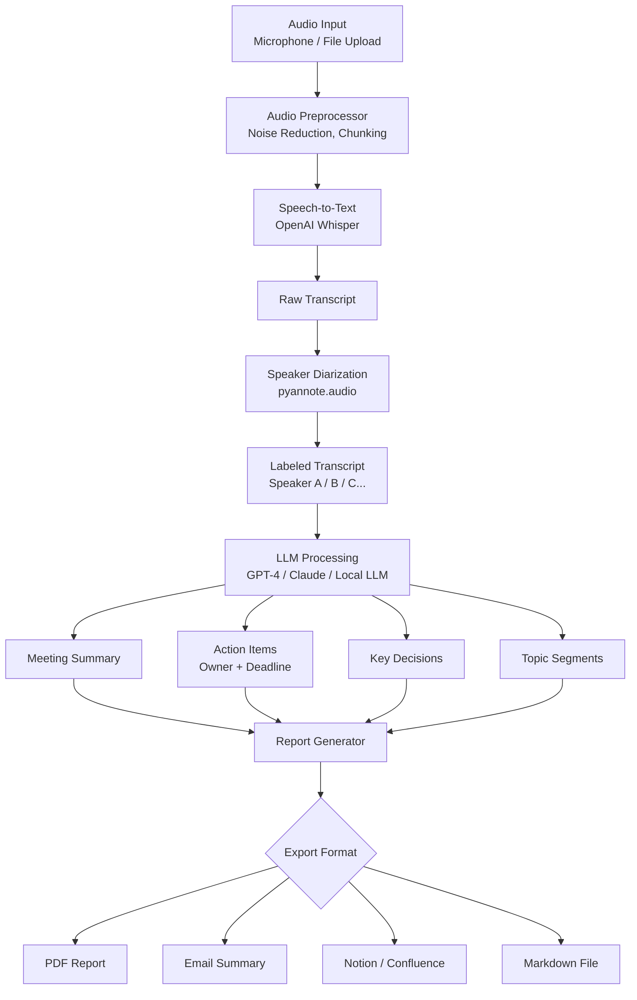

# MeetingMind

An AI-powered meeting assistant that automatically transcribes audio, generates intelligent summaries, and extracts actionable items — so you never miss what matters.

## Architecture



## Features

- High-accuracy transcription in 50+ languages (Whisper)
- Automatic speaker diarization — who said what
- AI-generated meeting summaries and highlights
- Action item extraction with owner and deadline detection
- Sentiment analysis per speaker
- Export to PDF, Markdown, Notion, Slack
- Real-time live transcription mode

## Tech Stack

| Layer | Technology |
|-------|-----------|
| Language | Python 3.10+ |
| Transcription | OpenAI Whisper (large-v3) |
| Diarization | pyannote.audio |
| LLM | GPT-4 / Claude 3 / Ollama |
| Backend API | FastAPI |
| Frontend | React + TailwindCSS |
| Database | PostgreSQL + SQLAlchemy |
| Task Queue | Celery + Redis |
| Storage | AWS S3 / Local |

## How to Run

```bash
# 1. Clone and install
git clone https://github.com/jadfarhat-cell/meetingmind.git
cd meetingmind
pip install -r requirements.txt
npm install --prefix frontend

# 2. Configure environment
cp .env.example .env
# Add your OpenAI API key, database URL, Redis URL

# 3. Start services
docker-compose up -d # PostgreSQL + Redis

# 4. Run backend
uvicorn backend.main:app --reload --port 8000

# 5. Run frontend
npm run dev --prefix frontend

# 6. Transcribe a file directly
python cli.py --input meeting.mp3 --output report.pdf
```

## Project Structure

```
meetingmind/
├── backend/
│ ├── main.py # FastAPI app
│ ├── transcriber.py # Whisper integration
│ ├── diarizer.py # Speaker separation
│ ├── llm_processor.py # Summary & action items
│ └── exporter.py # PDF, Markdown, Notion
├── frontend/
│ ├── src/
│ │ ├── components/
│ │ └── pages/
│ └── package.json
├── cli.py # Command-line interface
├── docker-compose.yml
├── requirements.txt
└── .env.example
```